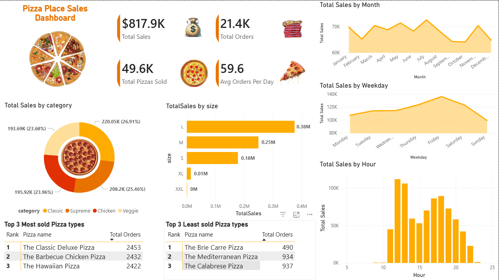
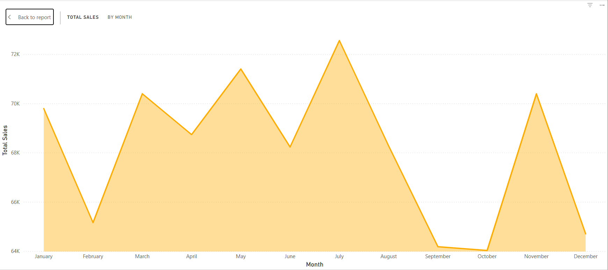
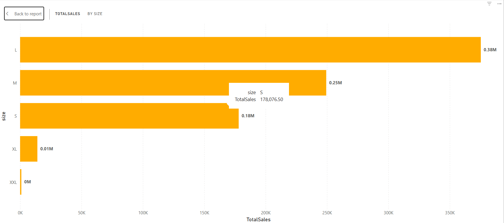
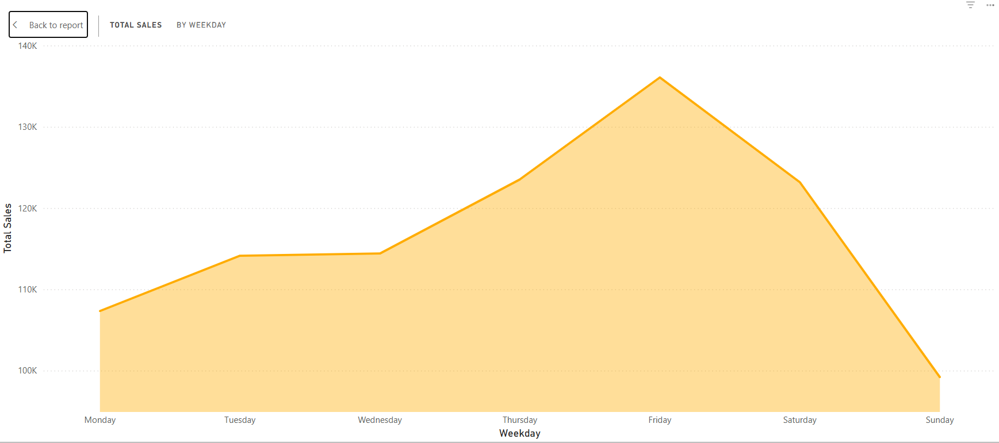
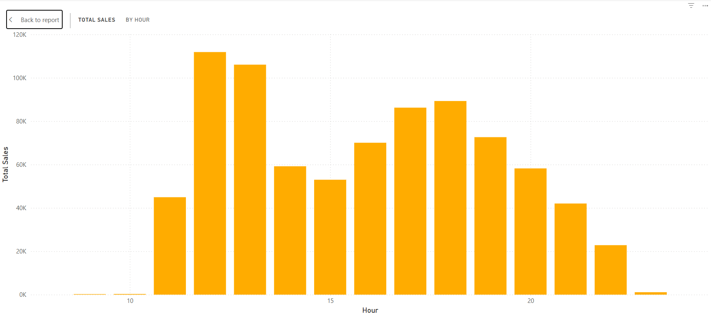

# Power BI Portfolio – Javlonbek Davronov

**Production Data Analyst → Transitioning to full-time Data Analyst**  
Real-world factory experience (SAP → Excel → Power BI) + public projects built during 8-week sprint (Dec 2025 – Feb 2026).

## Project 1: Pizza Place Sales Dashboard (Maven Analytics Challenge)

**Dataset**: Public Pizza Place Sales (2023 data) – $817.9K revenue, 49.6K pizzas sold  
**Objective**: Analyse sales patterns and identify growth opportunities  

**Key Insights**
- Classic category = 26.9% of total revenue
- Peak sales: Fridays/Saturdays + dinner hours (5–9 PM)
- Highest performer: The Classic Deluxe Pizza (2,453 orders)
- Opportunity: Boost slow months (February, September)

**Tools Used**
- Power BI Desktop
- DAX measures (Total Revenue, Avg Order Value)
- Interactive visuals & filters

**Screenshots**

  

[Download Full Interactive Report (PDF)](Pizza%20Place%20Sales%20Dashboard.pdf)

More projects coming:  
- Production Efficiency Dashboard (anonymized real company data)  
- SQL interview projects  
- Python/Pandas analysis  

Open to Junior Data Analyst / BI Analyst roles.  
Let’s connect: www.linkedin.com/in/jdavronov

#DataAnalytics #PowerBI #SQL #OpenToWork

## Project 2: Production Efficiency Dashboard (Anonymized Real Manufacturing Data)

**Context**: Daily analysis of 100+ weaving machines in a textile manufacturing company.  
**Objective**: Identify low-performing machines, wastage patterns, and improvement opportunities to reduce costs and downtime.

**Key Insights**
- 74% of machines operate below 100 points (efficiency benchmark)
- Highest wastage and manufacturing defects concentrated in a small group of machines
- Spare parts expenses and stoppages strongly correlate with low performance
- Potential for 10–15% efficiency gain through targeted maintenance on bottom performers

**Tools Used**
- Power BI Desktop
- DAX measures for custom scoring and KPIs
- Interactive filters by period, loom group, and production year

**Screenshots**

(02. Radar.png)

(03. Waste and Defects.png)

(04. Points based on indicators.png)

(05. Key indicators.png)

(06. Looms' share based on points.png)

[Download Full Report (PDF)](01. Full View.pdf)
