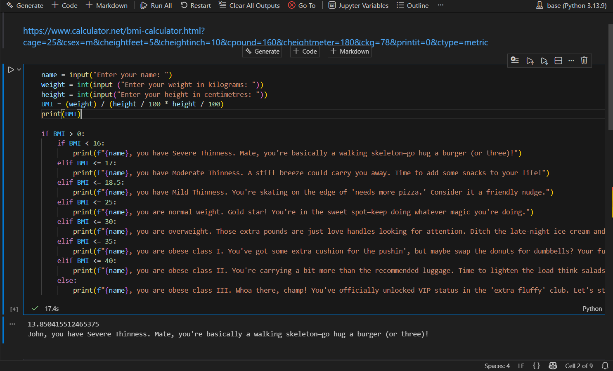

# Python Projects

Early Python practice during 8-week Data Analyst sprint.

## BMI Calculator with Personality 😏

Simple console tool that:
- Takes name, weight (kg), height (cm)
- Calculates BMI
- Gives health category with... honest (and funny) feedback

Built on Dec 31, 2025 — first complete Python project.

### How to Run
1. Copy the code into a .py file or Jupyter notebook
2. Run it
3. Enter your details
4. Prepare for the roast (or praise)

### Code Highlights
- Input handling
- Conditional logic (if/elif/else)
- Personalized output

Future upgrades:
- Loop for multiple calculations
- Data logging
- GUI version

Screenshot of it running:

Full code below (or in bmi_calculator.py)
